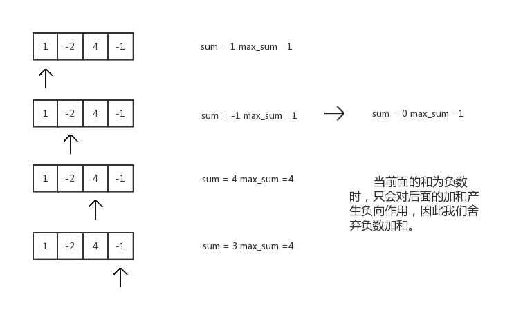

### LeetCode - Maximum Subarray


原题网址：https://leetcode.com/problems/maximum-subarray/#/description

Find the contiguous subarray within an array (containing at least one number) which has the largest sum.

For example, given the array `[-2,1,-3,4,-1,2,1,-5,4]`,
the contiguous subarray `[4,-1,2,1]` has the largest sum = `6`.

题解：

　　在一个数组中找到连续和最大的子数组。

记第一个数为nums[0]，第 i 个数为nums[i]。从nums[0]依次向后扫描，并记录nums[0]—nums[i]的所有和，由于数组中有负数，存在总和减小的情况，因此我们同时要记下最大和。若nums[0]—nums[i]的和为负数，就舍弃这i个数的和。认为i+1个数为第一个数，从新重复上述计算，直到扫描到数组的最后一个数，返回记录的最大值。


下面举个例子来说明这样做的原因：



最后返回最大加和4。

思路清晰，代码很简单，附上代码：

```c++
class Solution {
public:
    int maxSubArray(vector<int>& nums) {
       int sum, sum_max, max=nums[0];
       sum = sum_max = 0;
       for(int i=0;i<nums.size();i++)
       {
            if(nums[i] > max) max =nums[i];
       		sum = sum + nums[i];
       		if(sum <0) sum=0; 
       		if(sum > sum_max) sum_max = sum;
       }
       if (max<0) return max;
       return sum_max;
    }
};
```


转载请附上本文链接：


​	

　　

