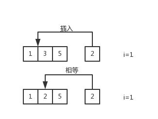

### LeetCode - Search Insert Position

原题网址：https://leetcode.com/problems/search-insert-position/#/description

Given a sorted array and a target value, return the index if the target is found. If not, return the index where it would be if it were inserted in order.

You may assume no duplicates in the array.

Here are few examples.
[1,3,5,6], 5 → 2
[1,3,5,6], 2 → 1
[1,3,5,6], 7 → 4
[1,3,5,6], 0 → 0

题解：

  在有序数组中找到一个数，并返回它在 数组中的位置。如果数组中没有这个数，按照大小顺序插入这个数，并返回插入后这个数所在的数组的位置。

  记有序数组为nums，插入的数为target。依次对比nums中的值与target的大小，当target值小于等于nums[i]时，无论target是否在列表中，我们需要返回的值都是i。


  需要注意的是，要单独考虑当插入的数在末尾时的情况，此时直接返回列表长度。

附上代码：

```c++
class Solution {
public:
    int searchInsert(vector<int>& nums, int target) 
    {
    	int i = 0;
    	if (target > nums.back()) return nums.size();
        while(nums[i]<target) i += 1;
        return i;
    }
};
```

转载请附上本文地址：